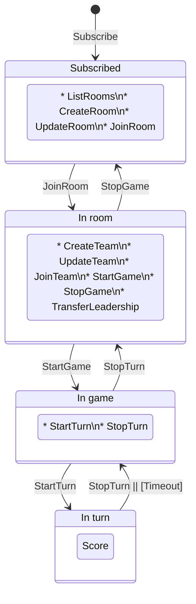

# Account service

```mermaid
stateDiagram-v2
    subscribed: Subscribed

    [*] --> subscribed: Subscribe
    state subscribed{
        inmenu: * ListRooms\n* CreateRoom\n* UpdateRoom\n* JoinRoom
    }

    state "In room" as inroom{
        "null0": * CreateTeam\n* UpdateTeam\n* JoinTeam\n* StartGame\n* StopGame\n* TransferLeadership
    }

    state "In game" as ingame{
        "null1": * StartTurn\n* StopTurn
    }

    state "In turn" as inturn{
        Score
    }

    subscribed --> inroom: JoinRoom
    inroom --> subscribed: StopGame
    inroom --> ingame: StartGame
    ingame --> inroom: StopTurn
    ingame --> inturn: StartTurn
    inturn --> ingame: StopTurn || [Timeout]
```
